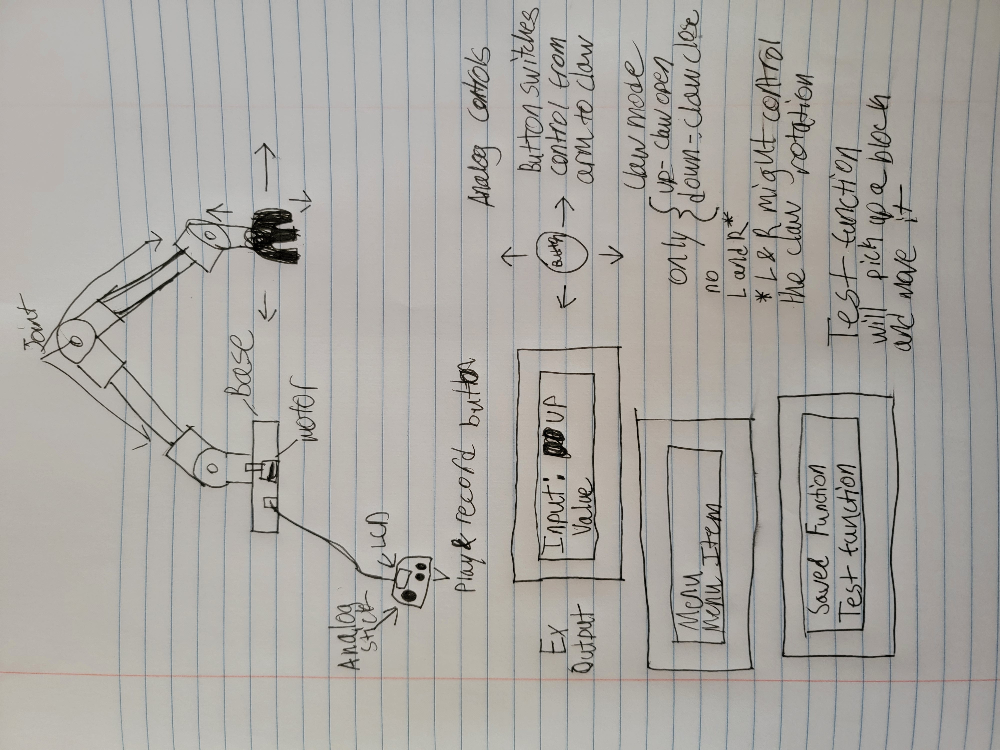

# 23/24 Engeering 4 Robot Arm Project 
## Programmable Multi-Axis Robot Arm
By Luke Wylie and Joshua O'Neill Rossouw

## Table of Contents
1. [Planning](#planning)
   1. [Scope](#scope)
   2. [Schedule](#schedule)
   3. [Diagrams](#diagrams)
   4. [Bill of Materials](#bill-of-materials)
   5. [Pseudocode](#pseudocode)
2. [Documentation](#documentation)
   1. [CAD](#cad)
   2. [Code](#code)
   3. [Wiring Diagram](#wiring-diagram)

# Planning
## Scope
In this project, we will create a programmable robot arm that can record and loop user inputs to repeat the movements necessary to complete a specific task. The base will be able to clamp onto a surface to stabilize the arm and provide an axis of rotation for the arm. The arm will be constructed out of three hinge joints one connecting the arm base to the first arm segment, the second between the first and second arm segments, and the third between the second arm joint and the claw assembly. The claw comprises four individual blades centered around a central worm gear, which is actuated by a motor, which rotates the blades. A user input device, tethered by a heat-shrunk length of wires, will send inputs to the arm. The inputs on the control device will be a joystick for the axial movements of the joints, a button that switches the joystick to controlling the claw when pressed once and switches back to controlling the arm when pressed again, a button that starts and stops the recording of the inputs, and a button which accesses the menu on the readout LCD. The readout LCD will also be located on the control device and will display pertinent information regarding the movement of the arm.

## Schedule
| Week                        |  Goal                                                                                     |
| :-------------------------: |  :-------------------------------------------------------------------------------------:
| Week 1 (March 25-29) |  Finish planning document and CAD for the arm.  |
| Week 2 (April 8-12)  |  Print arm CAD, making adjustments if needed, and starting the controller CAD.  |
| Week 3 (April 15-19) |  Finish CAD for the controller and print.  |
| Week 4 (April 22-26) |  Start assembly for arm and start the code for the basic arm control input.  |
| Week 5 (April 29-May 3) |  Start assembly for controller and start the code for the record and play functionality.  |
| Week 6 (May 6-10) |  Finish code for the project and assembly.  |
| Week 7 (May 13-17) |  Test the functionality of the project and start the documentation.  |
| Week 8 (May 20-24) |  Finish documentation.  |
Note: This is a tentative schedule for illustrative purposes, and subject to change based numerous factor such as how the completion of different steps and when the official project due date. A reflective schedule will be included in the documentation and will be based on the timeframe in which steps are actually completed.
## Diagrams

## Bill Of Materials

## Pseudocode

# Documentation

## CAD
[Link to onshape](https://cvilleschools.onshape.com/documents/e30ffb94e8ba368b6e045edf/w/2e96059f558c7828030257d8/e/bc3dcf792d39e192dca5e8ad)

## Code

## Wiring Diagram

