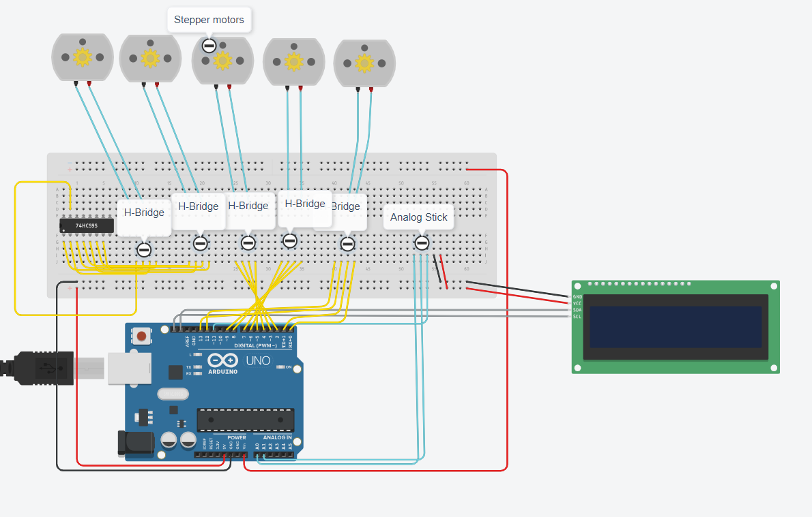

# 23/24 Engeering 4 Robot Arm Project 
## Programmable Multi-Axis Robot Arm
By Luke Wylie and Joshua O'Neill Rossouw

## Table of Contents
1. [Planning](#planning)
   1. [Scope](#scope)
   2. [Schedule](#schedule)
   3. [Diagrams](#diagrams)
   4. [Bill of Materials](#bill-of-materials)
   5. [Pseudocode](#pseudocode)
2. [Documentation](#documentation)
   1. [CAD](#cad)
   2. [Code](#code)
   3. [Wiring Diagram](#wiring-diagram)
   4. [Evidence](#evidence)
   5. [Reflective Schedule](#reflective-schedule)
   6. [Reflection](#reflection)

# Planning
## Scope
In this project, we will create a programmable robot arm to record and loop user inputs to repeat the movements necessary to complete a specific task. The base will be able to clamp onto a surface to stabilize the arm and provide an axis of rotation for the arm. The arm will be constructed out of three hinge joints one connecting the arm base to the first arm segment, the second between the first and second arm segments, and the third between the second arm joint and the claw assembly. The claw comprises four individual blades centered around a central worm gear, which is actuated by a motor, which rotates the blades. A user input device, tethered by a heat-shrunk length of wires, will send inputs to the arm. The inputs on the control device will be a joystick for the axial movements of the joints, a button that switches the joystick to controlling the claw when pressed once and switches back to controlling the arm when pressed again, a button that starts and stops the recording of the inputs, and a button which accesses the menu on the readout LCD. The readout LCD will also be located on the control device and will display pertinent information regarding the movement of the arm.

## Schedule
| Week                        |  Goal                                                                                     |
| :-------------------------: |  :-------------------------------------------------------------------------------------:  |
| Week 1 (March 25-29) |  Finish planning document and CAD for the arm.  |
| Week 2 (April 8-12)  |  Print the arm and start designing the controller.  |
| Week 3 (April 15-19) |  Finish and print the controller.  |
| Week 4 (April 22-26) |  Start assembling the arm and coding the arm control input.  |
| Week 5 (April 29-May 3) |  Start assembling the controller and coding the record functionality.  |
| Week 6 (May 6-10) |  Finish coding and assembling the project.  |
| Week 7 (May 13-17) |  Test the functionality and start the documentation.  |
| Week 8 (May 20-24) |  Finish the documentation.  |

Note: This is a tentative schedule for illustrative purposes, and is subject to change based on numerous factors such as the completion of different steps and when the official project due date. 
## Diagrams


## Bill Of Materials
|  Name  |  Description  |  Quantity  |
| :----: | :-----------: | :--------: |
| Nema 17 | Stepper Motor | 5 |
| Metro M4 Airlift | Microcontroller Board | 1 |
| T-slot Aluminium Extrusion | 20 x 20 x 510 | 2 |
| Base | 3D Printed | 1 |
| Base Joint | 3D Printed | 1 |
| Female Arm Joint | 3D Printed | 2 |
| Male Arm Joint | 3D Printed | 2 |
| Claw Base | 3D Printed | 1 |
| Claw Main Screw Gear | 3D Printed | 1 |
| Claw Globoid Gear | 3D Printed | 4 |
| Claw | 3D Printed | 4 |
| Claw Shaft | 3D Printed | 4 |
| Claw Spacer | 3D Printed | 8 |
		
		

## Pseudocode

```
Setup motors
Setup analog stick
Setup LCD
Define variables
Define states
Define Menus
While the analog stick is moved and in the arm state:
Move the arm motors this way
Print the movement to the LCD
When the analog stick button is pressed:
Change state
Print state change to the LCD
While the analog stick is moved and in the claw state:
Move the claw motors this way
Print the movement to the LCD
When the record button is pressed and the record is OFF:
Change record to ON
Print the record ON to the LCD
While the record is ON:
Save the movements the arm makes and state changes
If the record button is pressed again stop recording
When play is pressed
Play the saved movements
When the menu is opened:
Print to LCD the menu item
When the analog stick is moved on the menu:
Move to the next menu item
When play is pressed on the menu:
Run the menu item's corresponding function
```


# Documentation

## CAD
[Link to onshape](https://cvilleschools.onshape.com/documents/e30ffb94e8ba368b6e045edf/w/2e96059f558c7828030257d8/e/bc3dcf792d39e192dca5e8ad)

## Code

```python
import time
import board
from digitalio import DigitalInOut, Direction, Pull
import analogio 
from lcd import LCD
import busio
from i2c_pcf8574_interface import I2CPCF8574Interface
import adafruit_74hc595
from adafruit_motor import stepper


spi = busio.SPI(board.SCK, MOSI=board.MOSI)
latch_pin = DigitalInOut(board.D0)
sr = adafruit_74hc595.ShiftRegister74HC595(spi, latch_pin)
pins = [sr.get_pin(n) for n in range(8)]
btn = DigitalInOut(board.D11)
btn.direction = Direction.INPUT
btn.pull = Pull.UP
ax = analogio.AnalogIn(board.A0)
ay = analogio.AnalogIn(board.A1)
pot_min = 0.00
pot_max = 3.29
step = (pot_max - pot_min) / 20.0
state = 0
i2c = board.I2C()
lcd = LCD(I2CPCF8574Interface(i2c, 0x27), num_rows=2, num_cols=16)
last_position = 0
DELAY = 0.01  
STEPS = 50
mode = "menu"
recordPress = 0
switchState = 0
recording = []
recordingNow = False
coils = (
    DigitalInOut(board.D6),   # A1
    DigitalInOut(board.D5),  # A2
    DigitalInOut(board.D3),  # B1
    DigitalInOut(board.D4),  # B2
    DigitalInOut(board.D10),   # A1
    DigitalInOut(board.D9),  # A2
    DigitalInOut(board.D7),  # B1
    DigitalInOut(board.D8),  # B2
    DigitalInOut(board.D13),   # A1
    DigitalInOut(board.D12),  # A2
    DigitalInOut(board.D1),  # B1
    DigitalInOut(board.D2),  # B2
)

for coil in coils:
    coil.direction = Direction.OUTPUT
motorM1 = stepper.StepperMotor(coils[0], coils[1], coils[2], coils[3], microsteps=None)
motorM2 = stepper.StepperMotor(coils[4], coils[5], coils[6], coils[7], microsteps=None)
motorM3 = stepper.StepperMotor(coils[8], coils[9], coils[10], coils[11], microsteps=None)
motorM4 = stepper.StepperMotor(pins[0], pins[1], pins[2], pins[3], microsteps=None)
motorM5 = stepper.StepperMotor(pins[4], pins[5], pins[6], pins[7], microsteps=None)
armX = 0
armY = 0
clawRot = 0
clawOpen = 0
menu_pos = 0
arm_dirX = ""
arm_dirY = ""
aDir = "null"
rbtn = DigitalInOut(board.A4)
rbtn.direction = Direction.INPUT
rbtn.pull = Pull.UP
mbtn = DigitalInOut(board.A5)
mbtn.direction = Direction.INPUT
mbtn.pull = Pull.UP
def analog_direction():
    if x <= 11 and x >= 9 and y <= 11 and y >= 9:
        return str("null")
    elif x >= 9 and x <= 11 and y >= 0 and y <=2:
        return str("N")
    elif x == 20 and y >= 9 and y <=11:
        return str("E")
    elif x >= 0 and x <= 2 and y >= 9 and y <= 11:
        return str("W")
    elif x >= 9 and x <= 11 and y == 20:
        return str("S")
    elif x == 20 and y >= 0 and y <= 2:
        return str("NE")
    elif x == 0 and y == 0:
        return str("NW")
    elif x <= 3 and y == 20:
        return str("SW")
    elif x == 20 and y == 20:
        return str("SE")

def get_voltage(pin):
    return (pin.value * 3.3) / 65536

def steps(axis):
    return round((axis - pot_min) / step)


while True:
    x = steps(get_voltage(ax))
    y = steps(get_voltage(ay))
    print(x, y)
    if mode == "menu":
        lcd.clear()
        if analog_direction() == "E":
            if menu_pos < 5:
                menu_pos += 1
            if menu_pos >= 5:
                menu_pos = 0
            if menu_pos < 0:
                menu_pos = 4
        if analog_direction() == "W":
            if menu_pos < 5:
                menu_pos -= 1
            if menu_pos >= 5:
                menu_pos = 0
            if menu_pos < 0:
                menu_pos = 4     
        if menu_pos == 0:
            lcd.set_cursor_pos(0, 0)
            lcd.print("Menu")
            lcd.set_cursor_pos(1, 0)
            lcd.print("Move Arm")
        elif menu_pos == 1:
            lcd.set_cursor_pos(0, 0)
            lcd.print("Menu")
            lcd.set_cursor_pos(1, 0)
            lcd.print("Move Claw")
        elif menu_pos == 2:
            lcd.set_cursor_pos(0, 0)
            lcd.print("Menu")
            lcd.set_cursor_pos(1, 0)
            lcd.print("Reset")
        elif menu_pos == 3:
            lcd.set_cursor_pos(0, 0)
            lcd.print("Menu")
            lcd.set_cursor_pos(1, 0)
            lcd.print("Calibrate")
        elif menu_pos == 4:
            lcd.set_cursor_pos(0, 0)
            lcd.print("Menu")
            lcd.set_cursor_pos(1, 0)
            lcd.print("Play")
        if state == 1 and mode == "menu":
            if menu_pos == 0:
                mode = "arm"
            elif menu_pos == 1:
                mode = "claw"
            elif menu_pos == 2:
                mode = "reset"
            elif menu_pos == 3:
                mode = "calibrate"
            elif menu_pos == 4:
                mode = "play"
            state = 0
        time.sleep(.1)
    if mode == "arm":
        aDir = analog_direction()
        arm_dirX = ""
        arm_dirY = ""
        lcd.clear()
        lcd.set_cursor_pos(0, 0)
        lcd.print("Move Arm")
        lcd.set_cursor_pos(1, 0)
        if analog_direction() == "null":
            if recordingNow == True:
                recording.append("null")
        if analog_direction() == "N":
            motorM2.onestep(style=stepper.DOUBLE)
            motorM1.onestep(direction=stepper.BACKWARD, style=stepper.DOUBLE)
            arm_dirY = "+Y"
            if recordingNow == True:
                recording.append("AN")
        if analog_direction() == "S":
            motorM1.onestep(style=stepper.DOUBLE)
            motorM2.onestep(direction=stepper.BACKWARD, style=stepper.DOUBLE)
            arm_dirY = "-Y"
            if recordingNow == True:
                recording.append("AS")
        if analog_direction() == "E":
            motorM3.onestep(style=stepper.DOUBLE)
            arm_dirX = "+X"
            if recordingNow == True:
                recording.append("AE")   
        if analog_direction() == "W":
            motorM3.onestep(direction=stepper.BACKWARD, style=stepper.DOUBLE)
            arm_dirX = "-X"
            if recordingNow == True:
                recording.append("AW")
        if analog_direction() == "NE":
            motorM2.onestep(style=stepper.DOUBLE)
            motorM1.onestep(direction=stepper.BACKWARD, style=stepper.DOUBLE)
            motorM3.onestep(style=stepper.DOUBLE)
            arm_dirX = "+X"
            arm_dirY = "+Y"
            if recordingNow == True:
                recording.append("ANE")
        if analog_direction() == "NW":
            motorM1.onestep(style=stepper.DOUBLE)
            motorM2.onestep(direction=stepper.BACKWARD, style=stepper.DOUBLE)
            motorM3.onestep(direction=stepper.BACKWARD, style=stepper.DOUBLE)
            arm_dirX = "-X"
            arm_dirY = "+Y"
            if recordingNow == True:
                recording.append("ANW")
        if analog_direction() == "SE":
            motorM1.onestep(style=stepper.DOUBLE)
            motorM2.onestep(direction=stepper.BACKWARD, style=stepper.DOUBLE)
            motorM3.onestep(style=stepper.DOUBLE)
            arm_dirX = "+X"
            arm_dirY = "-Y"
            if recordingNow == True:
                recording.append("ASE")
        if analog_direction() == "SW":
            motorM1.onestep(style=stepper.DOUBLE)
            motorM2.onestep(direction=stepper.BACKWARD, style=stepper.DOUBLE)
            motorM3.onestep(direction=stepper.BACKWARD, style=stepper.DOUBLE)
            arm_dirX = "-X"
            arm_dirY = "-Y"
            if recordingNow == True:
                recording.append("ASW")
        lcd.print(arm_dirX + ", " + arm_dirY)
        if state == 1:
            mode = "menu"
            state = 0
            time.sleep(1)
        if switchState == 1:
            mode = "arm"
            switchState = 0
    if mode == "claw":
        claw_rot = ""
        claw_open = ""
        lcd.clear()
        lcd.set_cursor_pos(0, 0)
        lcd.print("Move Claw")
        lcd.set_cursor_pos(1, 0)
        if analog_direction() == "null":
            if recordingNow == True:
                recording.append("null")
        if analog_direction() == "N":
            motorM4.onestep(direction=stepper.BACKWARD, style=stepper.DOUBLE)
            claw_rot = "+"
            if recordingNow == True:
                recording.append("CN")
        if analog_direction() == "S":
            motorM4.onestep(style=stepper.DOUBLE)
            claw_rot = "-"
            if recordingNow == True:
                recording.append("CS")
        if analog_direction() == "E":
            motorM5.onestep(style=stepper.DOUBLE)
            claw_open = "+"
            if recordingNow == True:
                recording.append("CE")
        if analog_direction() == "W":
            motorM5.onestep(direction=stepper.BACKWARD, style=stepper.DOUBLE)
            claw_open = "-"
            if recordingNow == True:
                recording.append("CW")
        if analog_direction() == "NE":
            motorM4.onestep(direction=stepper.BACKWARD, style=stepper.DOUBLE)
            motorM5.onestep(style=stepper.DOUBLE)
            claw_rot = "+"
            claw_open = "+"
            if recordingNow == True:
                recording.append("CNE")
        if analog_direction() == "NW":
            motorM4.onestep(direction=stepper.BACKWARD, style=stepper.DOUBLE)
            motorM5.onestep(direction=stepper.BACKWARD, style=stepper.DOUBLE)
            claw_rot = "-"
            claw_open = "+"
            if recordingNow == True:
                recording.append("CNW")
        if analog_direction() == "SE":
            motorM4.onestep(style=stepper.DOUBLE)
            motorM5.onestep(style=stepper.DOUBLE)
            claw_rot = "+"
            claw_open = "-"
            if recordingNow == True:
                recording.append("CSE")
        if analog_direction() == "SW":
            motorM4.onestep(style=stepper.DOUBLE)
            motorM5.onestep(direction=stepper.BACKWARD, style=stepper.DOUBLE)
            claw_rot = "-"
            claw_open = "-"
            if recordingNow == True:
                recording.append("CSW")
        lcd.print(claw_rot + ", " + claw_open)
        if state == 1:
            mode = "menu"
            state = 0
            time.sleep(1)
        if switchState == 1:
            mode = "claw"
            switchState = 0
    if mode == "reset":
        lcd.clear()
        lcd.set_cursor_pos(0, 0)
        lcd.print("Reset Done")
        recording = []
        if state == 1:
                mode = "menu"
                state = 0
                time.sleep(1)   
    if mode == "calibrate":
        lcd.clear()
        lcd.set_cursor_pos(0, 0)
        lcd.print("no")
        if state == 1:
                mode = "menu"
                state = 0
                time.sleep(1)   
    if mode == "play":
        lcd.clear()
        lcd.set_cursor_pos(0, 0)
        lcd.print("Play")
        recordingNow = False
        for action in recording:
            if action == "null":
                time.sleep(.01)
            elif action == "CN":
                motorM4.onestep(direction=stepper.BACKWARD, style=stepper.DOUBLE)
                time.sleep(.01)
            elif action == "CS":
                motorM4.onestep(style=stepper.DOUBLE)
                time.sleep(.01)
            elif action == "CE":
                motorM5.onestep(style=stepper.DOUBLE)
                time.sleep(.01)
            elif action == "CW":
                motorM5.onestep(direction=stepper.BACKWARD, style=stepper.DOUBLE)
                time.sleep(.01)
            elif action == "CNE":
                motorM4.onestep(direction=stepper.BACKWARD, style=stepper.DOUBLE)
                motorM5.onestep(style=stepper.DOUBLE)
                time.sleep(.01)
            elif action == "CNW":
                motorM4.onestep(direction=stepper.BACKWARD, style=stepper.DOUBLE)
                motorM5.onestep(direction=stepper.BACKWARD, style=stepper.DOUBLE)
                time.sleep(.01)
            elif action == "CSE":
                motorM4.onestep(style=stepper.DOUBLE)
                motorM5.onestep(style=stepper.DOUBLE)
                time.sleep(.01)
            elif action == "CSW":
                motorM4.onestep(style=stepper.DOUBLE)
                motorM5.onestep(direction=stepper.BACKWARD, style=stepper.DOUBLE)
                time.sleep(.01)
            elif action == "AN":
                motorM2.onestep(style=stepper.DOUBLE)
                motorM1.onestep(direction=stepper.BACKWARD, style=stepper.DOUBLE)
                time.sleep(.01)
            elif action == "AS":
                motorM1.onestep(style=stepper.DOUBLE)
                motorM2.onestep(direction=stepper.BACKWARD, style=stepper.DOUBLE)
                time.sleep(.01)
            elif action == "AE":
                motorM3.onestep(style=stepper.DOUBLE)
                time.sleep(.01)
            elif action == "AW":
                motorM3.onestep(direction=stepper.BACKWARD, style=stepper.DOUBLE)
                time.sleep(.01)
            elif action == "ANE":
                motorM2.onestep(style=stepper.DOUBLE)
                motorM1.onestep(direction=stepper.BACKWARD, style=stepper.DOUBLE)
                motorM3.onestep(style=stepper.DOUBLE)
                time.sleep(.01)
            elif action == "ANW":
                motorM1.onestep(style=stepper.DOUBLE)
                motorM2.onestep(direction=stepper.BACKWARD, style=stepper.DOUBLE)
                motorM3.onestep(direction=stepper.BACKWARD, style=stepper.DOUBLE)
                time.sleep(.01)
            elif action == "ASE":
                motorM1.onestep(style=stepper.DOUBLE)
                motorM2.onestep(direction=stepper.BACKWARD, style=stepper.DOUBLE)
                motorM3.onestep(style=stepper.DOUBLE)
                time.sleep(.01)
            elif action == "ASW":
                motorM1.onestep(style=stepper.DOUBLE)
                motorM2.onestep(direction=stepper.BACKWARD, style=stepper.DOUBLE)
                motorM3.onestep(direction=stepper.BACKWARD, style=stepper.DOUBLE)
                time.sleep(.01)
        lcd.set_cursor_pos(1, 0)
        lcd.print("Done")
        time.sleep(.5)
        print("done")
        if state == 1:
            mode = "menu"
            state = 0
            time.sleep(1)               
    if btn.value == False:
        switchState = 1
    elif btn.value == True:
        switchState = 0
    if rbtn.value == False:
        if recordingNow == True:
            recordingNow = False
            print("recording off")
            print(recording)
            time.sleep(.2)
        elif recordingNow == False:
            recordingNow = True
            print("recording on")
            time.sleep(.2)    
    if mbtn.value == False:
        state = 1
    elif mbtn.value == True:
        state = 0
    
```

## Wiring Diagram



## Evidence


## Reflective Schedule
| Week                        |  Goal                                                                                     |
| :-------------------------: |  :-------------------------------------------------------------------------------------:
| Week 1 (March 25-29) |  Finish planning document and CAD for the arm.  |
| Week 2 (April 8-12)  |  Print the arm and start designing the controller.  |
| Week 3 (April 15-19) |  Finish and print the controller.  |
| Week 4 (April 22-26) |  Start assembling the arm and coding the arm control input.  |
| Week 5 (April 29-May 3) |  Start assembling the controller and coding the record functionality.  |
| Week 6 (May 6-10) |  Finish coding and assembling the project.  |
| Week 7 (May 13-17) |  Test the functionality and start the documentation.  |
| Week 8 (May 20-24) |  Finished the documentation.  |

## Reflection

